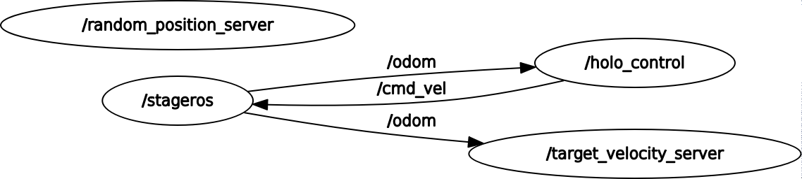

# Research Track 1 - Holonomic Control

The ROS nodes here contained allow for controlling an holonomic robot
by computing the velocity needed to drive it towards a target position,
here defined as a simple couple of random values between (-6.0, 6.0).
All nodes and custom services are contained in the package **holo_control**,
 along with their documentation.

## Running the code

The nodes presented can be started together by calling the launchfile included
in the package
```bash
$roslaunch holo_control holo_control.launch (va:=<velocity_algorithm>)
```
> the optional parameter <velocity_algorithm> is a number indicating which 
> algorithm to use in order to compute the velocity value. At the moment only 
> {0,1} have been implemented. Further information in the paragraph 
> **target_velocity_server**.

Or, individually, with
```bash
$rosrun holo_control random_position_server

$rosrun holo_control target_velocity_server

$rosrun holo_control holo_movement <velocity algorithm>
```
> Note that <velocity_algorithm> here has the same function as above, but in
> this case its presence is mandatory

Since they only provide the computation and services but no actual simulation,
another external node should carry out that part: that node should both read
messages sent in the topic _"/cmd_vel"_ and publish its odometry data in the
topic _"/odom"_.

---------

## Relational Graph


- **holo_movement** is subscribed to _"/odom"_ and publishes in _"/cmd_vel"_, while 
	calling Services _"/target_position"_ and _"/target_velocity"_
- **random_position_server** serves for Service _"/target_position"_
- **target_velocity_server** serves for Service _"/target_velocity"_ and is subscribed
	to topic _"/odom"_

## Nodes

Three nodes are present, two Service Servers and one publishing the velocity
informations.

#### holo_movement

This node is the one responsible for publishing velocity data on the topic _"/cmd_vel"_.
It does so by reading the estimated position of the active robot (messages present, 
again, in _"/odom"_) and, if the current target hasn't been reached, calling the Service
TargetVel, which carries in its _response_ the _x_ and _y_ component of the velocity that
this node will then publish in _"cmd_vel"_. If, otherwise, the target position has been
reached the node will call the Service TargetPos which will yield in its _response_ field
the coordinates of a new point to reach on the map.

#### random_position_server

Server node serving TargetPos, for the Service _"target_position"_. When a request is issued 
it fills the _response_ field of the Service with a random position, a composed of two random 
_x_ and _y_ coordinates.

#### target_velocity_server

Server node serving TargetVel, for the Service _"target_velocity"_. When a request is issued it 
fills the _response_ field of the Service with an _xy_ velocity based on the current and desired 
position of the robot to control, both passed as request elements in the Service, together with a _mode_.
This last parameter dictates which algorithm to use for computing the velocity, two are at
the moment implemented
- **0**: purely linear instantaneous dependency on the current position with respect to the target
- **1**: weighted sum of such instantaneous dependency with the previous estimated value of the 
	velocity, retrieved by subscribing to the _"/odom"_ topic.

---------

## Custom Messages and Services

To retrieve next target position and current velocity value to publish by _holo_movement_ two
custom Services where created, along with the Servers mentioned in the **Nodes** paragraph.

### Messages
No custom Messages were created.

### Services

#### TargetPos

Used to retrieve the destination of the robot, hold in the _request_ segment (while the _response_ is empty).

#### TargetVel

Used to retrieve the current velocity hold, _request_ field contains current estimated position and destination,
while _response_ contains a Twist in which are inserted the _x_ and _y_ component of the velocity.

---------

## Final Notes

Albeit the current Server for TargetPos Service is of no conrete use in a real world scenario, the modularity
allows for it to be seamlessly replaced by a different Server, still answering on the general _"/target_position"_
Service.
The same principle applies to the Service called by _holo_movement_ to retrieve the velocity to publish: while it's
true that those values could've been computed by that same node, this approach allows for future modification of the
algorithms utilized to perform such computation based on the current and target position, having to modify only the
value passed as argument to that node (or the to the launch file).

---------

## Dependencies

As previously mentioned the nodes in the package merely perform the computation by
reading from the topics _"/odom"_ and publishing in _"/cmd_vel"_, thus an external 
node must perform the simulation, for example the simulator shared by Professor Carmine
Tommaso Recchiuto at the link https://github.com/CarmineD8/assignment1.git which can be 
launched with
```bash
$rosrun stage_ros stageros $(rospack find assignment1)/world/exercise.world
```
Note that that package in turn requires **stage_ros**, which can be obtained with
```bash
$sudo apt-get install ros-<your_ros_version>-stage-ros
```

## Credits

Thanks to Professor Carmine Tommaso Recchiuto for providing the simulator this package 
was tested on, and being my main source of knowledge for ROS development.
